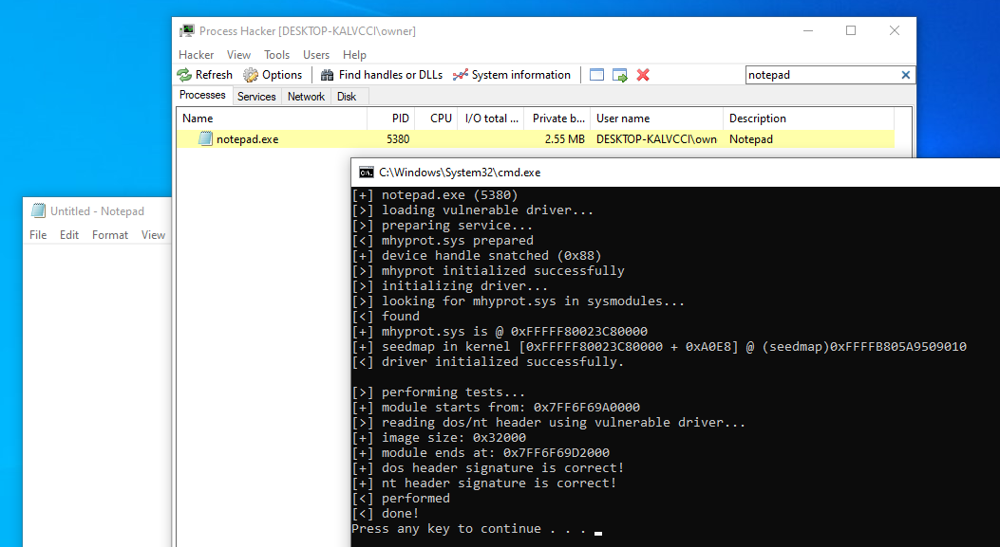
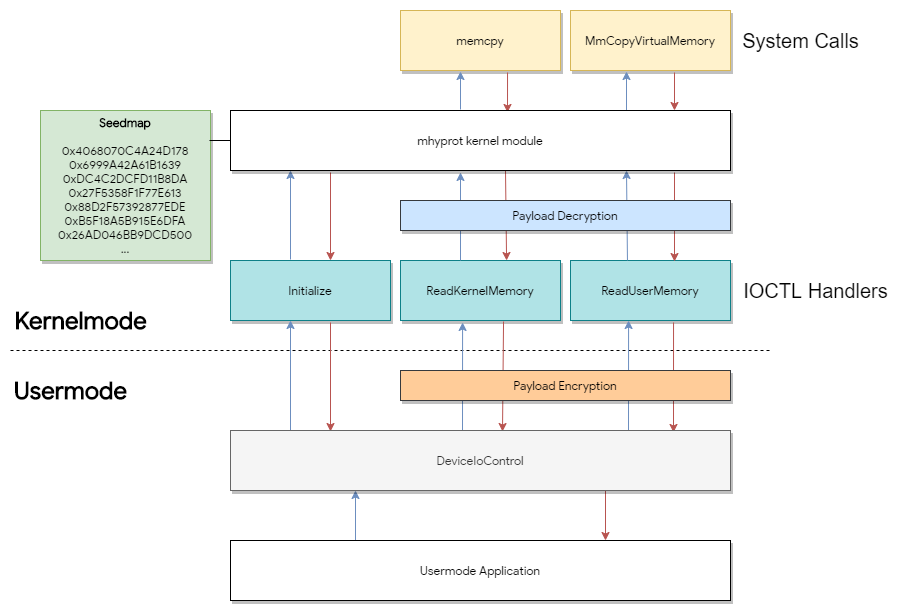
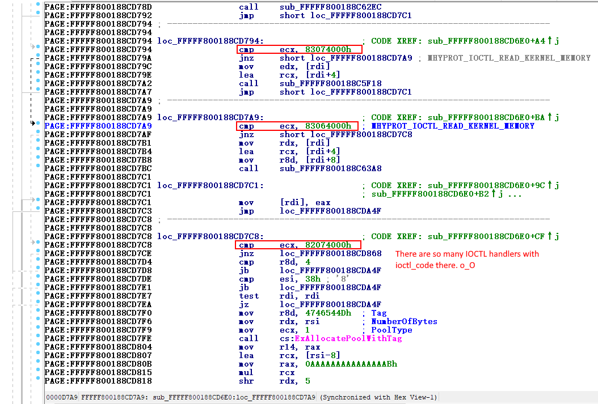

# evil-mhyprot-cli
A PoC for vulnerable driver "mhyprot" that allows us to read/write memory in kernel/user from usermode.

### Static Library is here: [libmhyprot](https://github.com/kkent030315/libmhyprot)

# Overview

What we can do with this CLI is as follows:

- Read/Write any kernel memory with privilege of kernel from usermode
- Read/Write any user memory with privilege of kernel from usermode
- All operations are executed as kernel level privilege (ring-0) by the vulnerable driver

Also:

- Administrator privilege only needed if the service is not yet running
- Therefore we can execute commands above as the normal user (w/o administrator privilege)

---

The `mhyprot` is an anti-cheat kernel mode driver used in [`Genshin Impact`](https://genshin.mihoyo.com/ja).  
The driver has a vulnerable `IOCTL` commands that allows us to execute `MmCopyVirtualMemory` and `memcpy(in the kernel!)` from ring-3 (usermode).



# Impact

Investigating

# Requirements

- Any version of Windows x64 that the driver works on
- Administrator privilege does not required if the service already running

# Usage

```
bin.exe [TargetProcess] -options
```

following options are available as of now:

- `t`
  - Perform Tests
- `d`
  - Print debug infos
- `s`
  - Print seedmap

# Analysis and Proofs

> The document(s) below is still in write
so please forgive any mistakes I took in advance.

## IOCTL Handler Functions

So what I did is that to reverse engineering around IOCTL handling functionalities.  

Since around ioctl functions and its functionalities are packed, to reverse engineering is not easy than average.  
but I can still easily find the function that registered at `DriverObject->MajorFunction[IRP_MJ_DEVICE_CONTROL]` since the IOCTL handler must have an `IoCompleteRequest` or like `IofCompleteRequest` that exported by `ntoskrnl`.  
(Btw `IoCompleteRequest` is just a wrapper of `IofCompleteRequest`)  


As mhyprot imports `IofCompleteRequest` then go xrefs, and we will see there are many ioctl handlers.  
Concretely, I found two big subroutine in packed segment.  

I've added it to [this repo](IDA) as binary since it's too big.  

- [sub_FFFFF800188CD000](IDA/sub_FFFFF800188CD000.txt)
- [sub_FFFFF800188CD6E0](IDA/sub_FFFFF800188CD6E0.txt)

I will keep update if I found more another subroutine.

## Driver Initialization

The `MHYPROT_IOCTL_INITIALIZE` what I defined in [mhyprot.hpp#L18](src/mhyprot.hpp#L18) can be found as follows:

```cpp
PAGE:FFFFF800188CD8FD loc_FFFFF800188CD8FD:                   ; CODE XREF: sub_FFFFF800188CD6E0+213↑j
PAGE:FFFFF800188CD8FD                 cmp     ecx, 80034000h  ; MHYPROT_IOCTL_INITIALIZE
PAGE:FFFFF800188CD903                 jnz     short loc_FFFFF800188CD984
PAGE:FFFFF800188CD905                 cmp     r8d, 10h
PAGE:FFFFF800188CD909                 jnz     loc_FFFFF800188CDA4F
PAGE:FFFFF800188CD90F                 mov     rax, 0EBBAAEF4FFF89042h // <- _m_002
PAGE:FFFFF800188CD919                 xor     [rdi+8], rax
PAGE:FFFFF800188CD91D                 mov     rax, [rdi+8]
PAGE:FFFFF800188CD921                 xor     [rdi], rax
PAGE:FFFFF800188CD924                 cmp     dword ptr [rdi+4], 0BAEBAEECh // <- _m_001
PAGE:FFFFF800188CD92B                 jnz     loc_FFFFF800188CDA4F
PAGE:FFFFF800188CD931                 mov     ecx, [rdi]
PAGE:FFFFF800188CD933                 call    sub_FFFFF800188C51A8
PAGE:FFFFF800188CD938                 cmp     dword ptr cs:qword_FFFFF800188CA108, 0
PAGE:FFFFF800188CD93F                 jnz     short loc_FFFFF800188CD97D
PAGE:FFFFF800188CD941                 mov     rdx, [rdi+8]
PAGE:FFFFF800188CD945                 lea     rcx, xmmword_FFFFF800188CA0E8
PAGE:FFFFF800188CD94C                 call    sub_FFFFF800188C301C // <-
PAGE:FFFFF800188CD951                 mov     ebx, 7
```

and the `sub_FFFFF800188C301C` is look like:

```cpp
.text:FFFFF800188C301C ; =============== S U B R O U T I N E =======================================
.text:FFFFF800188C301C
.text:FFFFF800188C301C
.text:FFFFF800188C301C sub_FFFFF800188C301C proc near          ; CODE XREF: sub_FFFFF800188CD6E0+26C↓p
.text:FFFFF800188C301C                                         ; DATA XREF: .upx0:FFFFF800189F2BA8↓o
.text:FFFFF800188C301C
.text:FFFFF800188C301C arg_0           = qword ptr  8
.text:FFFFF800188C301C
.text:FFFFF800188C301C                 test    rcx, rcx
.text:FFFFF800188C301F                 jz      locret_FFFFF800188C30B4
.text:FFFFF800188C3025                 mov     [rsp+arg_0], rbx
.text:FFFFF800188C302A                 push    rdi
.text:FFFFF800188C302B                 sub     rsp, 20h
.text:FFFFF800188C302F                 xor     eax, eax
.text:FFFFF800188C3031                 mov     rdi, rdx
.text:FFFFF800188C3034                 mov     [rcx], rax
.text:FFFFF800188C3037                 mov     rbx, rcx
.text:FFFFF800188C303A                 mov     [rcx+8], rax
.text:FFFFF800188C303E                 mov     edx, 9C0h       ; NumberOfBytes
.text:FFFFF800188C3043                 xor     ecx, ecx        ; PoolType
.text:FFFFF800188C3045                 call    cs:ExAllocatePool
.text:FFFFF800188C304B                 xor     edx, edx
.text:FFFFF800188C304D                 mov     r8d, 9C0h
.text:FFFFF800188C3053                 mov     rcx, rax
.text:FFFFF800188C3056                 mov     [rbx], rax
.text:FFFFF800188C3059                 call    sub_FFFFF800188C7900
.text:FFFFF800188C305E                 mov     rax, [rbx]
.text:FFFFF800188C3061                 mov     r9d, 1
.text:FFFFF800188C3067                 mov     [rbx+0Ch], r9d
.text:FFFFF800188C306B                 mov     [rax], rdi
.text:FFFFF800188C306E                 mov     [rbx+8], r9d
.text:FFFFF800188C3072
.text:FFFFF800188C3072 loc_FFFFF800188C3072:                   ; CODE XREF: sub_FFFFF800188C301C+8C↓j
.text:FFFFF800188C3072                 movsxd  r8, dword ptr [rbx+8]
.text:FFFFF800188C3076                 mov     rdx, [rbx]
.text:FFFFF800188C3079                 mov     rax, [rdx+r8*8-8]
.text:FFFFF800188C307E                 mov     rcx, rax
.text:FFFFF800188C3081                 shr     rcx, 3Eh
.text:FFFFF800188C3085                 xor     rcx, rax
.text:FFFFF800188C3088                 mov     rax, 5851F42D4C957F2Dh
.text:FFFFF800188C3092                 imul    rcx, rax
.text:FFFFF800188C3096                 add     rcx, r8
.text:FFFFF800188C3099                 mov     [rdx+r8*8], rcx
.text:FFFFF800188C309D                 add     [rbx+8], r9d
.text:FFFFF800188C30A1                 cmp     dword ptr [rbx+8], 138h
.text:FFFFF800188C30A8                 jl      short loc_FFFFF800188C3072
.text:FFFFF800188C30AA                 mov     rbx, [rsp+28h+arg_0]
.text:FFFFF800188C30AF                 add     rsp, 20h
.text:FFFFF800188C30B3                 pop     rdi
.text:FFFFF800188C30B4
.text:FFFFF800188C30B4 locret_FFFFF800188C30B4:                ; CODE XREF: sub_FFFFF800188C301C+3↑j
.text:FFFFF800188C30B4                 retn
.text:FFFFF800188C30B4 sub_FFFFF800188C301C endp
```

## A Way of Read/Write Specific Process Memory

The mhyprot calls `MmCopyVirtualMemory` eventually as wrapper defined as follows:

```cpp
__int64 __fastcall sub_FFFFF800188C3EB8(struct _EPROCESS *a1, _DWORD *a2, __int64 a3)
{
  __int64 v3; // rbp
  _DWORD *v4; // rdi
  struct _EPROCESS *v5; // rbx
  PEPROCESS v6; // rsi
  char v8; // [rsp+28h] [rbp-20h]

  v3 = a3;
  v4 = a2;
  v5 = a1;
  if ( *a2 == 1 )
  {
    v6 = IoGetCurrentProcess();
  }
  else
  {
    v6 = a1;
    v5 = IoGetCurrentProcess();
  }
  v8 = 0;
  return MmCopyVirtualMemory(v6, *((_QWORD *)v4 + 3), v5, *((_QWORD *)v4 + 2), (unsigned int)v4[8], v8, v3);
}
```

Called by:

```cpp
__int64 __fastcall sub_FFFFF800188C3F2C(_DWORD *a1_rw_request, __int64 a2_returnsize, __int64 a3)
{
  __int64 v3_returnsize; // rsi
  _DWORD *v4_rw_request; // rbx
  __int64 v5_processid; // rcx
  bool v6_ntstatus_lookup_success_bool; // di
  unsigned int v8_ntstatus; // ebx
  PVOID Object; // [rsp+40h] [rbp+8h]

  v3_returnsize = a2_returnsize;
  v4_rw_request = a1_rw_request;
  v5_processid = (unsigned int)a1_rw_request[2];
  Object = 0i64;
  v6_ntstatus_lookup_success_bool = (int)PsLookupProcessByProcessId(v5_processid, &Object, a3) >= 0;// NT_SUCCESS
  if ( !Object )
    return 3221225473i64;
  v8_ntstatus = sub_FFFFF800188C3EB8((struct _EPROCESS *)Object, v4_rw_request, v3_returnsize);
  if ( v6_ntstatus_lookup_success_bool )
    ObfDereferenceObject(Object);
  return v8_ntstatus;
}
```

Called by:

```cpp
bool __fastcall sub_FFFFF800188C4214(_DWORD *a1_rw_request, _DWORD *a2_returnsize, __int64 a3)
{
  _DWORD *v3_returnsize; // rbx
  int v5_ntstatus; // [rsp+20h] [rbp-18h]
  __int64 v6_returnsize; // [rsp+50h] [rbp+18h]

  v3_returnsize = a2_returnsize;
  v6_returnsize = 0i64;
  v5_ntstatus = sub_FFFFF800188C3F2C(a1_rw_request, (__int64)&v6_returnsize, a3);
  *v3_returnsize = v6_returnsize;
  return v5_ntstatus == 0;                      // NT_SUCCESS(v5_ntstatus)
}
```

Finally we are at the root of the tree:

```cpp
PAGE:FFFFF800188CD303 loc_FFFFF800188CD303:                   ; CODE XREF: sub_FFFFF800188CD000+2C7↑j
PAGE:FFFFF800188CD303                 and     dword ptr [rbp+1D0h+arg_20], 0
PAGE:FFFFF800188CD30A                 lea     rdx, [rbp+1D0h+arg_20]
PAGE:FFFFF800188CD311                 mov     rcx, [rsp+30h]
PAGE:FFFFF800188CD316                 call    sub_FFFFF800188C4214 // <- Here
PAGE:FFFFF800188CD31B                 jmp     loc_FFFFF800188CD21C
```

## A Way of Read/Write Kernel Memory

We can see so many IOCTL commands and the `MHYPROT_IOCTL_READ_KERNEL_MEMORY` what I defined in [mhyprot.hpp](src/mhyprot.hpp#L19) can be found as follows:

```cpp
PAGE:FFFFF800188CD7A9 loc_FFFFF800188CD7A9:                   ; CODE XREF: sub_FFFFF800188CD6E0+BA↑j
PAGE:FFFFF800188CD7A9                 cmp     ecx, 83064000h  ; MHYPROT_IOCTL_READ_KERNEL_MEMORY
PAGE:FFFFF800188CD7AF                 jnz     short loc_FFFFF800188CD7C8
PAGE:FFFFF800188CD7B1                 mov     rdx, [rdi]
PAGE:FFFFF800188CD7B4                 lea     rcx, [rdi+4]
PAGE:FFFFF800188CD7B8                 mov     r8d, [rdi+8]
PAGE:FFFFF800188CD7BC                 call    sub_FFFFF800188C63A8 // <-
```

And the `sub_FFFFF800188C63A8` is like:

```cpp
.text:FFFFF800188C63A8 sub_FFFFF800188C63A8 proc near          ; CODE XREF: sub_FFFFF800188CD6E0+DC↓p
.text:FFFFF800188C63A8                                         ; DATA XREF: .upx0:FFFFF800189F2EE4↓o
.text:FFFFF800188C63A8
.text:FFFFF800188C63A8 arg_0           = qword ptr  8
.text:FFFFF800188C63A8 arg_8           = qword ptr  10h
.text:FFFFF800188C63A8
.text:FFFFF800188C63A8                 mov     [rsp+arg_0], rbx
.text:FFFFF800188C63AD                 mov     [rsp+arg_8], rsi
.text:FFFFF800188C63B2                 push    rdi
.text:FFFFF800188C63B3                 sub     rsp, 20h
.text:FFFFF800188C63B7                 mov     edi, r8d
.text:FFFFF800188C63BA                 mov     rbx, rdx
.text:FFFFF800188C63BD                 mov     rsi, rcx
.text:FFFFF800188C63C0                 test    rdx, rdx
.text:FFFFF800188C63C3                 jz      short loc_FFFFF800188C63F2
.text:FFFFF800188C63C5                 test    r8d, r8d
.text:FFFFF800188C63C8                 jz      short loc_FFFFF800188C63F2
.text:FFFFF800188C63CA                 mov     rax, cs:MmHighestUserAddress
.text:FFFFF800188C63D1                 cmp     rdx, [rax]
.text:FFFFF800188C63D4                 jb      short loc_FFFFF800188C63F2
.text:FFFFF800188C63D6                 mov     r8d, edi
.text:FFFFF800188C63D9                 xor     edx, edx
.text:FFFFF800188C63DB                 call    sub_FFFFF800188C7900
.text:FFFFF800188C63E0                 mov     r8d, edi
.text:FFFFF800188C63E3                 mov     rdx, rsi
.text:FFFFF800188C63E6                 mov     rcx, rbx
.text:FFFFF800188C63E9                 call    sub_FFFFF800188C3DD8
.text:FFFFF800188C63EE                 xor     eax, eax
.text:FFFFF800188C63F0                 jmp     short loc_FFFFF800188C63F5
```
  
Here is the ioctl handlers, found the `0x83064000`(`MHYPROT_IOCTL_READ_KERNEL_MEMORY`) as `cmp     ecx, 83064000h` and some another ioctl codes as follows:


